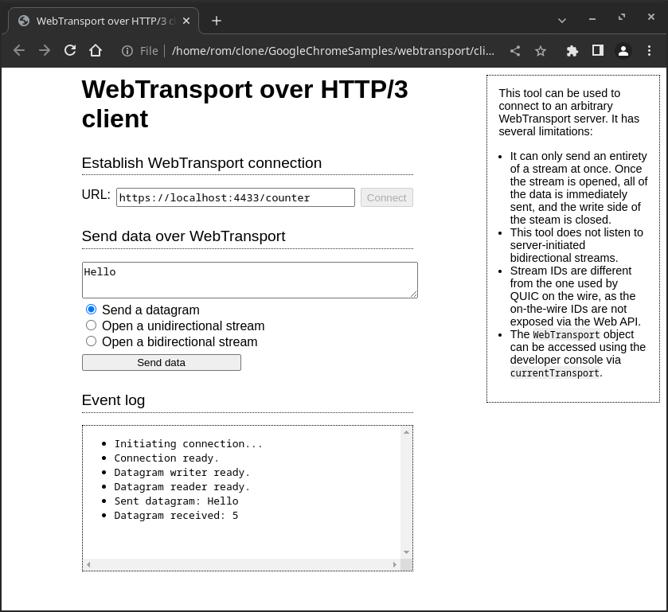
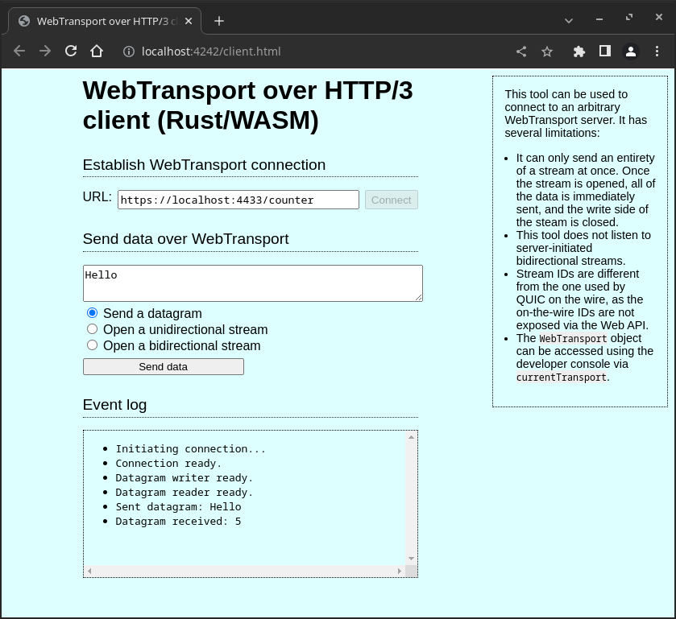

This is a reimplementation in Rust/Wasm of the client part of the
[WebTransport sample] from the GoogleChrome samples repo. It is fully functional
and compatible with the offical sample server.

[WebTransport sample]: https://github.com/GoogleChrome/samples/tree/gh-pages/webtransport

## Screenshots

The official sample:



The Wasm sample:



(The background color has been changed to distinguish them easily.)

## Client page

The client [JavaScript file](client.js) is now minimal, it just exposes the Rust
`WasmCtx` object (defined in [`src/lib.rs`](src/lib.rs)) in a `wasm` variable.

```javascript
import init, { WasmCtx } from "./pkg/wasm_webtransport.js";
await init();

self.wasm = WasmCtx.new();
```

The client HTML and CSS have been copied from the original project, with very
few changes:

```diff
diff --git b/client.css a/client.css
index 0dfec9f..11f0745 100644
--- b/client.css
+++ a/client.css
@@ -1,4 +1,5 @@
 body {
+  background-color: #ddffff;
   font-family: sans-serif;
 }
 
diff --git b/client.html a/client.html
index 1f87c17..2e6d2ff 100644
--- b/client.html
+++ a/client.html
@@ -4,7 +4,7 @@
   <meta charset="utf-8">
   <!-- WebTransport origin trial token. See https://developer.chrome.com/origintrials/#/view_trial/793759434324049921 -->
   <meta http-equiv="origin-trial" content="AkSQvBVsfMTgBtlakApX94hWGyBPQJXerRc2Aq8g/sKTMF+yG62+bFUB2yIxaK1furrNH3KNNeJV00UZSZHicw4AAABceyJvcmlnaW4iOiJodHRwczovL2dvb2dsZWNocm9tZS5naXRodWIuaW86NDQzIiwiZmVhdHVyZSI6IldlYlRyYW5zcG9ydCIsImV4cGlyeSI6MTY0Mzc1OTk5OX0=">
-  <script src="client.js"></script>
+  <script src="client.js" type="module"></script>
   <link rel="stylesheet" href="client.css">
   <meta name="viewport" content="width=device-width, initial-scale=1">
   <body>
@@ -31,12 +31,12 @@
       <label for="url">URL:</label>
       <input type="text" name="url" id="url"
              value="https://localhost:4433/counter">
-      <input type="button" id="connect" value="Connect" onclick="connect()">
+      <input type="button" id="connect" value="Connect" onclick="wasm.connect()">
       </div>
     </div>
     <div>
       <h2>Send data over WebTransport</h2>
-      <form name="sending">
+      <form id="sending" name="sending">
       <textarea name="data" id="data"></textarea>
       <div>
         <input type="radio" name="sendtype" value="datagram"
@@ -52,7 +52,7 @@
         <label for="bidi-stream">Open a bidirectional stream</label>
       </div>
       <input type="button" id="send" name="send" value="Send data"
-             disabled onclick="sendData()">
+             disabled onclick="wasm.send_data()">
       </form>
     </div>
     <div>
```

The code from the original [`client.js`] is now implemented in Rust in
[`src/lib.rs`](src/lib.rs).

[`client.js`]: https://github.com/GoogleChrome/samples/blob/2bb27d915e3cbfe5ba4fc80fe4922baca16db703/webtransport/client.js

## Build and run

First, run the Python server from the [WebTransport sample], using the dummy
self-signed certificate/key committed in this repo (this project is only the
client).

Then build and run the client:

```bash
make        # build
make serve  # serve using python http.server module
make run    # open sample in chromium
```

## Documentation

 - <https://developer.mozilla.org/en-US/docs/WebAssembly/Rust_to_wasm>
 - <https://rustwasm.github.io/docs/wasm-pack/>
 - <https://rustwasm.github.io/wasm-bindgen/introduction.html>
 - <https://rustwasm.github.io/wasm-bindgen/api/web_sys/>
 - <https://rustwasm.github.io/wasm-bindgen/api/wasm_bindgen_futures/>
 - <https://developer.mozilla.org/en-US/docs/Web/API/WebTransport_API>
